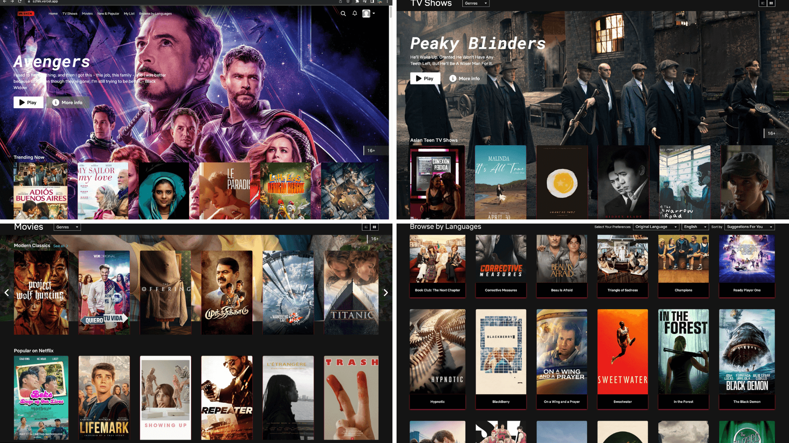
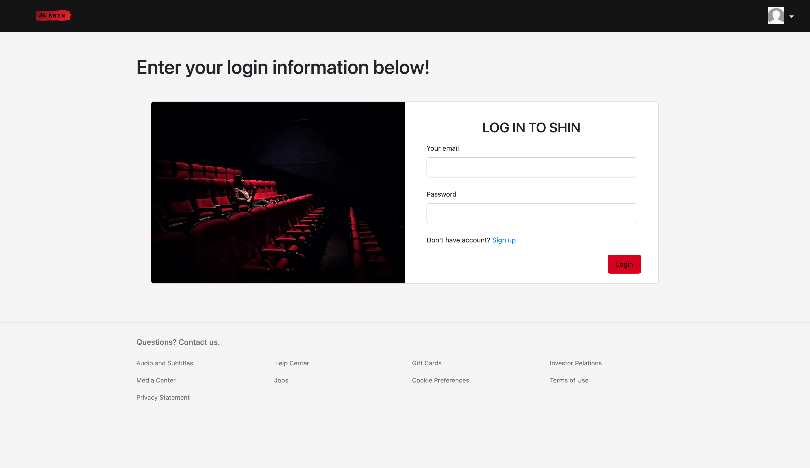
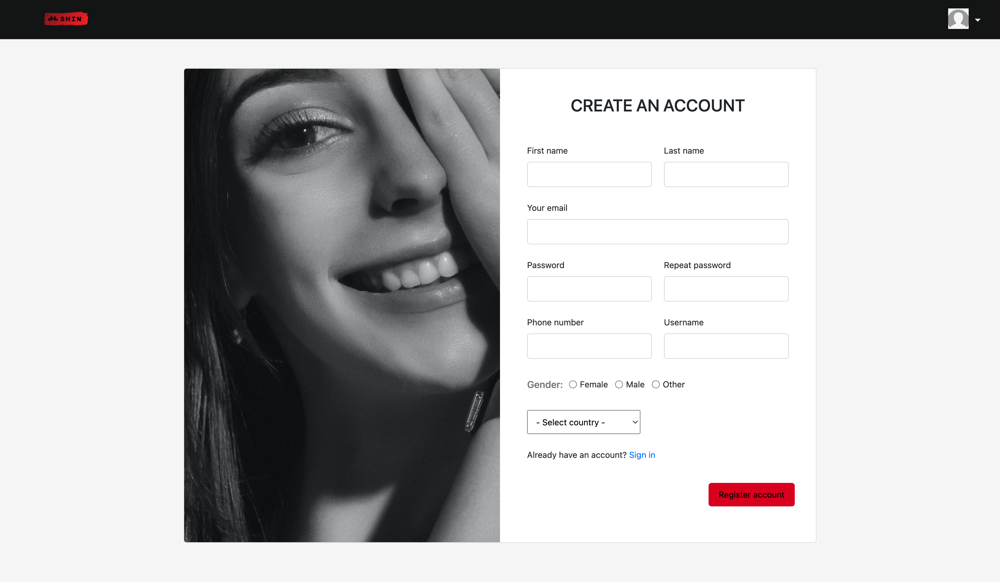
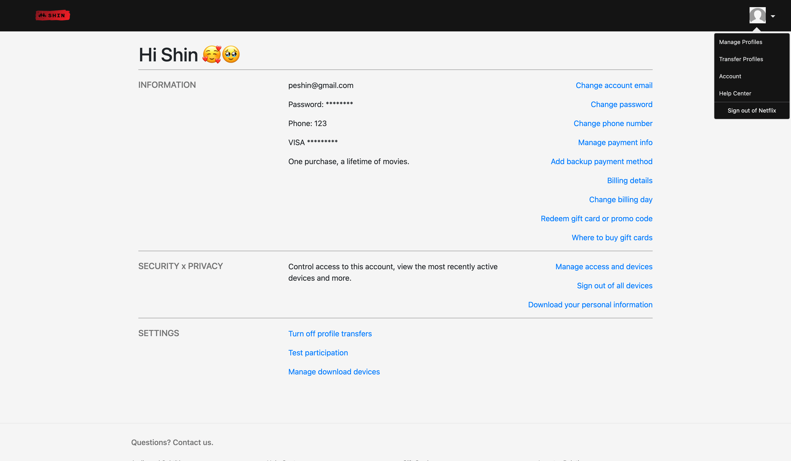
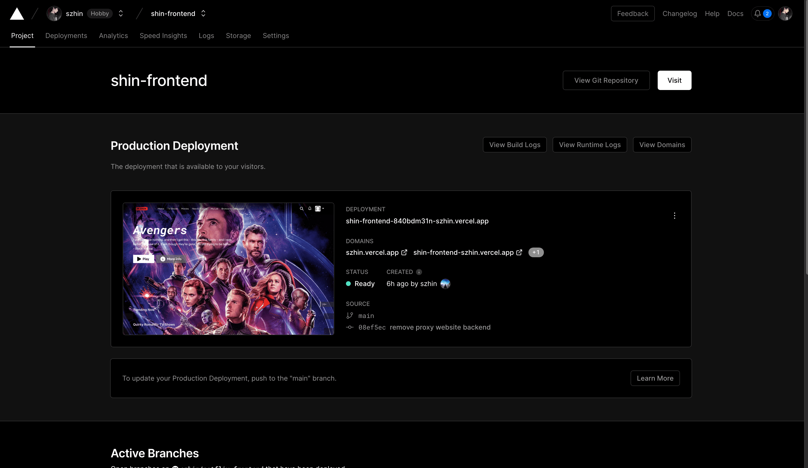
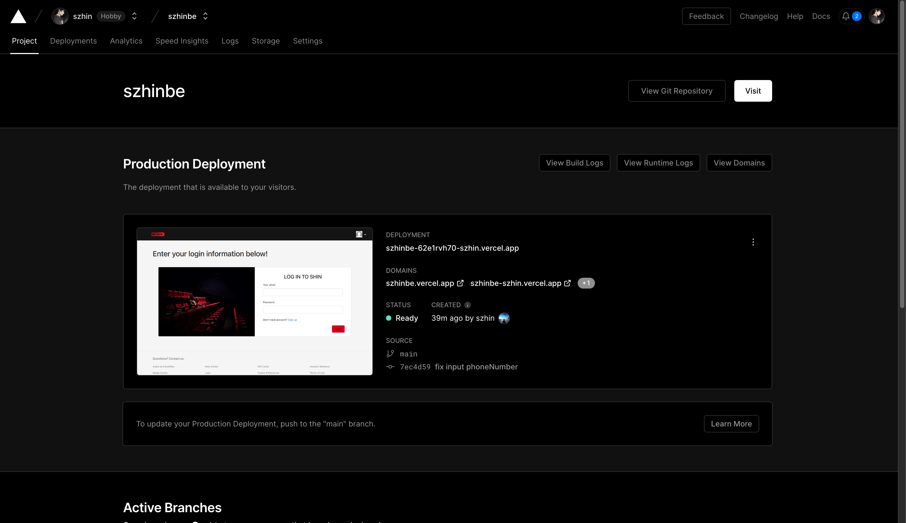

# Shin Movies Website

Welcome to the README file for Shin Movie Web, a movie streaming web application created by Pham Cao Bang. This web application has been developed using a combination of front-end and back-end technologies. The front-end is built using React.js, while the back-end is powered by Node.js with the Express framework. The database is hosted on MongoDB Atlas, and the web application is deployed using Vercel on vercel.com.

Here is the deployed Front-end site: [https://szhin.vercel.app](https://szhin.vercel.app)
Here is the deployed Back-end site: [https://szhinbe.vercel.app](https://szhinbe.vercel.app)

## Table of Contents

  - [Front-end](#front-end)
  - [Back-end](#back-end)
  - [Database](#database)
  - [Deployment](#deployment)
  - [Conclusion](#conclusion)
  - [License](#license)
  
  ## Front-end
  
  The front-end of the **Shin Movie Web** is developed using React.js. It provides a user-friendly interface with various features and functionalities. Here are the main components and functionalities of the front-end:
  
  ### React.js Project Setup

  To set up a React.js project, follow these steps:

  1. Open your terminal.
  2. Navigate to the desired directory where you want to create the project.
  3. Run the following command:
  
  ```bash
    $ npx create-react-app shin-movie-web
    $ cd shin-movie-web
    $ npm start
  ```
  
  This command will create a new React.js project named "shin-movie-web" in your current directory.
  
  ### Main Pages
  
  The Shin Movie Web includes the following main pages:

  1. **Home**: The landing page of the movie web application.
  2. **TV Shows**: Browse and explore various TV shows available for streaming.
  3. **Movies**: Discover a wide range of movies to watch.
  4. **New & Popular**: Find the latest and most popular content.
  5. **My List**: Manage and view your personalized list of favorite movies and TV shows.
  6. **Browse by Language**: Filter and search for content based on language.

  

  ## Back-end
  
  The back-end of the Shin Movie Web is built using Node.js and the Express framework. It handles the server-side logic and provides necessary APIs for the front-end. Here is an overview of the back-end setup and features:
  
  ### Node.js Express Project Setup
  
  To create a Node.js Express project, follow these steps:

  1. Open your terminal.
  2. Navigate to the desired directory where you want to create the project.
  3. Run the following commands:
  
  ```bash
    $ mkdir shin-movie-web-backend
    $ cd shin-movie-web-backend
    $ npm init -y
    $ npm install express
  ```
  
  This will create a new directory for your backend project, initialize a new Node.js project, and install the Express framework.
  
  ### Function
  
  The back-end of Shin Movie Web includes the following images:

  1. **Login**: Represents the login page for users.
  
  
  
  2. **Register**: Illustrates the registration page for new users.
   
  
  
  3. **YourAccount**: Displays the account settings page for authenticated users.
  
  
  
  ### Connecting to MongoDB Atlas
  
  To connect the back-end to MongoDB Atlas, you need to configure the MongoDB connection string in your Node.js code. Here is an example of how to establish the connection:
  
  ```javascript
    async function connect() {
      mongoose
          .connect(process.env.NAME_URL_CONNECT_MONGODB, {          
              useNewUrlParser: true,
              useUnifiedTopology: true,
          })
          .then(() => {
              console.log('Successfully connected to MongoDB Atlas!');
          })
          .catch((error) => {
              console.log('Unable to connect to MongoDB Atlas!');
              console.error(error);
          });
    }
  ```
  
  ### Libraries
  
  This is some libraries in package.json file

  ```javascript
    "dependencies": {
          "bcrypt": "^5.1.0",
          "connect-flash": "^0.1.1",
          "express": "^4.18.2",
          "express-handlebars": "^7.0.7",
          "express-session": "^1.17.3", 
          "jsonwebtoken": "^9.0.0",
          "mongoose": "^7.1.0",
          "mongoose-slug-updater": "^3.3.0",
          "path": "^0.12.7",
      },
      "devDependencies": {
          "morgan": "^1.10.0",
          "nodemon": "^2.0.22",
          "sass": "^1.62.1"
      }
  ```
  
  ## Database
  
  Shin Movie Web utilizes MongoDB Atlas as the hosted database solution. To set up the database, follow these steps:

  You can read the docs on how to use MongoDB Atlas here: [https://www.mongodb.com/docs/atlas](https://www.mongodb.com/docs/atlas).
  
  Here is an example url that you will use to connect your app to MongoDB Atlas:
  
  ```bash
    MONGODB_URI=mongodb+srv://<username>:<password>@<cluster-url>/<database>?retryWrites=true&w=majority
  ```
  
  Replace `<username>`, `<password>`, `<cluster-url>`, and `<database>` with your MongoDB Atlas credentials and database information.
  
  You can watch the video tutorial here: [Link video here!!](https://www.youtube.com/watch?v=Nmv2-oSQyWE)
  
  ## Deployment
  
  Shin Movie Web is deployed using Vercel, a cloud platform for static sites and serverless functions. To deploy the web application to Vercel, follow these steps:
 
  You can read the docs on how to use Vercel here: [https://vercel.com/docs](https://vercel.com/docs)  
  
  Here is the deployed Front-end site: [https://szhin.vercel.app](https://szhin.vercel.app)
  
  
  
  Here is the deployed Back-end site: [https://szhinbe.vercel.app](https://szhinbe.vercel.app)
  
  
  
  ## Conclusion
  
  Thank you for exploring the Shin Movie Web project. We hope you enjoy using our movie streaming web application. If you have any questions or need further assistance, please don't hesitate to reach out. Have a nice day! 😇🌱🍀🦋
  
  My contact: uzumakinarutoshin@gmail.com
  
  ## License

  This project is licensed under the MIT License.
